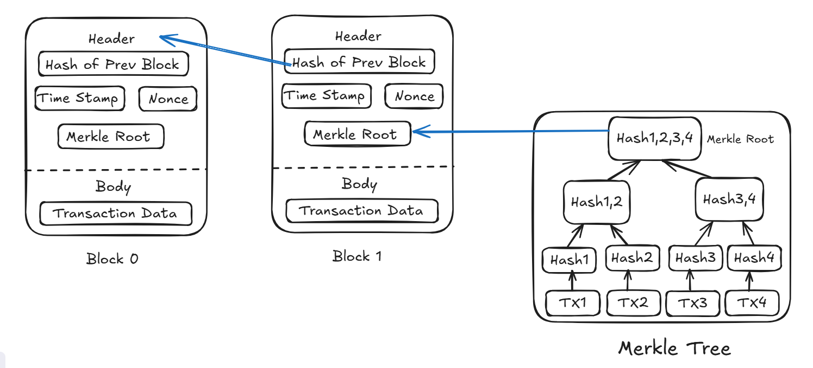

#### Blockchain Basics
#### => Define Blockchain
Blockchain is similar to an electronic notebook that several individuals can access simultaneously. It makes records of items such as money, messages, or data. Each time someone adds something new, it is recorded as a "block" of data. The blocks are connected one after another, similar to a chain. Once something is entered in the chain, it becomes difficult to change or remove it. Everyone in the network has a replica of the chain, so it is extremely difficult to lie or cheat. This means blockchain is extremely safe and reliable. It operates without a boss or owner, so everyone trusts the system even if they don't trust one another.

#### => List 2 real-life use cases
1. Voting Systems
Blockchain can be used for online voting in elections. It makes sure that every vote is counted correctly and cannot be changed. It also helps people vote safely from their phones or computers, and prevents cheating like double voting.

2.  Healthcare Records
Hospitals can use blockchain to store patient records securely. Only the patient and trusted doctors can see the records. This helps in sharing medical history between hospitals while keeping it private and safe from hackers.

#### Block Anatomy

#### => Draw a block showing: data, previous hash, timestamp, nonce, and Merkle root.

#### => Briefly explain with an example how the Merkle root helps verify data integrity.

A Merkle root is a special code (a hash) that represents all the data in a block. It helps quickly check if the data has been changed or not, without looking at the entire data.

Example:
Imagine you have 4 transactions:
T1, T2, T3, and T4.

First, hash each transaction:
H1 = hash(T1)
H2 = hash(T2)
H3 = hash(T3)
H4 = hash(T4)

Then combine and hash them again:
H12 = hash(H1 + H2)
H34 = hash(H3 + H4)

Finally, create the Merkle root:
Root = hash(H12 + H34)

*Now, if someone changes T3, even a tiny bit, the final Merkle root will be different, showing that the data was changed.*

#### Consensus Conceptualization

#### => What is Proof of Work and why does it require energy?
Proof of Work (PoW) is a consensus mechanism where network participants, known as miners, compete to solve complex mathematical puzzles to validate and add new blocks to the blockchain. The process involves repeatedly trying different values (nonces) until a hash meeting a specific difficulty is found. This requires significant computational power, leading to high energy consumption. The energy-intensive nature of PoW makes it difficult for any single entity to control the network and helps secure the blockchain against attacks such as double spending.

#### => What is Proof of Stake and how does it differ?
Proof of Stake (PoS) is an energy-efficient alternative to Proof of Work. In PoS, validators are chosen to create new blocks based on the amount of cryptocurrency they "stake" or lock in the network. The higher the stake, the greater the chance of being selected. Unlike PoW, PoS does not require solving complex puzzles, thus consuming much less energy. It relies on economic incentives and penalties to maintain security and encourage honest behavior among validators.

#### => What is Delegated Proof of Stake and how are validators selected?
Delegated Proof of Stake (DPoS) is a variation of PoS where token holders vote for a limited number of delegates (validators) who are responsible for validating transactions and producing blocks. The selection is based on democratic voting, where users choose trusted representatives instead of participating directly in block validation. If a delegate acts dishonestly, they can be replaced by community votes. DPoS increases transaction speed and network efficiency while maintaining decentralization through community governance.